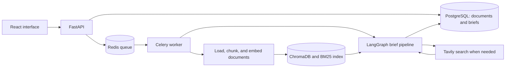
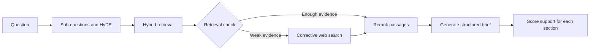

# Briefr


Briefr turns a question and optional PDF or DOCX documents into a research brief. It retrieves supporting passages, searches the web when retrieval is weak, and produces sections with citations and model-assessed support scores.

[Run locally](#quick-start) | [Architecture](#architecture) | [Example workflow](#example-workflow) | [Code tour](#code-tour)

## What you can inspect

- Document ingestion with visible pending, processing, ready, and failed states.
- Keyword and vector retrieval combined with reciprocal rank fusion.
- A cross-encoder that reranks retrieved passages before generation.
- Structured briefs with source references, open questions, and section-level scores.
- Background work handled by Celery, with results stored in PostgreSQL.
- A React interface for uploading documents and reading completed briefs.

## Architecture





Docker Compose runs six long-lived services: frontend, backend, worker, PostgreSQL, Redis, and ChromaDB. A separate migration service runs Alembic before the backend and worker start.

## Quick start

Requires Git, Docker with Compose, and API keys for Anthropic, OpenAI embeddings, and Tavily search.

```bash
git clone https://github.com/codezenithdev/ragforge.git
cd ragforge
```

Copy [.env.example](.env.example) to `.env`, then set `ANTHROPIC_API_KEY`, `OPENAI_API_KEY`, and `TAVILY_API_KEY`.

```bash
docker compose up --build
```

- Interface: <http://localhost:3000>
- API documentation: <http://localhost:8000/docs>
- Health endpoint: <http://localhost:8000/health>

The first build downloads model dependencies. The development override mounts backend source and enables API reload. The base Compose configuration uses local-development credentials and publishes service ports; it is not the production configuration.

If `API_KEY` is configured, API requests must include `X-API-Key`. Authentication is disabled only in development when that key is unset. Production configuration also requires explicit CORS origins and the provider keys; see [backend/app/core/config.py](backend/app/core/config.py) and [docker-compose.prod.yml](docker-compose.prod.yml).

## Example workflow

1. Upload a PDF or DOCX that you can use for testing.
2. Wait for its ingestion status to become `ready`.
3. Ask a question that the document can help answer.
4. Open the completed brief and check the cited passages, support scores, and open questions.

For example, use a public technical report and ask: **"What deployment constraints does this report identify, and which questions remain unanswered?"** This is a suggested input, not a recorded benchmark.

The [output schema](backend/app/rag/generation/schemas.py) contains:

| Field | Contents |
| --- | --- |
| `title` | Brief title |
| `executive_summary` | Summary with citation IDs and a support score |
| `key_facts` | Individual findings with citations and scores |
| `risks_and_limitations` | Gaps and caveats |
| `opportunities` | Potential next steps |
| `open_questions` | Questions left unresolved |
| `sources` | Referenced documents or web sources |

The support scores come from a model assessment. They are not calibrated probabilities or a guarantee that a claim is correct.

### API example

This Bash example assumes local development with API authentication unset. If you configure `API_KEY`, add `-H "X-API-Key: $API_KEY"` to each request.

```bash
curl -F "file=@report.pdf" http://localhost:8000/api/v1/documents/upload
curl http://localhost:8000/api/v1/documents
```

The upload returns a `document_id` and a pending status. After that document is ready, replace `DOCUMENT_ID` below with its ID:

```bash
curl -X POST http://localhost:8000/api/v1/briefs \
  -H "Content-Type: application/json" \
  -d '{"query":"What deployment constraints does this report identify?","document_ids":["DOCUMENT_ID"]}'
```

Use the returned `brief_id` to poll `GET /api/v1/briefs/BRIEF_ID`. Brief creation is asynchronous. An optional `Idempotency-Key` header supports retrying a submission without creating a second brief during the configured retention window.

## Code tour

| Design choice | Implementation |
| --- | --- |
| Upload validation and asynchronous ingestion | [documents.py](backend/app/api/routes/documents.py), [tasks.py](backend/app/tasks.py) |
| Shared queue with persistent job records | [briefs.py](backend/app/api/routes/briefs.py), [models](backend/app/models/) |
| Combined keyword and vector ranking | [hybrid.py](backend/app/rag/retrieval/hybrid.py), [reranker.py](backend/app/rag/retrieval/reranker.py) |
| Conditional web retrieval | [graph.py](backend/app/rag/pipeline/graph.py), [crag.py](backend/app/rag/pipeline/crag.py) |
| Typed output and section scoring | [schemas.py](backend/app/rag/generation/schemas.py), [faithfulness_scorer.py](backend/app/rag/evaluation/faithfulness_scorer.py) |
| Request authentication and configured limits | [security.py](backend/app/core/security.py), [config.py](backend/app/core/config.py) |

ChromaDB runs as a server because both the API and worker need access. The Celery worker reuses an asyncio event loop for asynchronous clients. Schema changes are handled by Alembic migrations rather than automatic table creation at application startup.

## Testing and evaluation

From `backend/`, create and activate a Python environment, install `requirements.txt`, then run:

```bash
python -m pytest -q
```

The test suite mocks external model, web, and vector services. [test_eval_retrieval.py](backend/tests/test_eval_retrieval.py) evaluates ranking against a committed [golden dataset](backend/tests/data/golden/golden.json).

The separate `python scripts/run_eval.py` command runs from `backend/` and requires the configured APIs, services, and ingested corpus. It writes `eval-out/report.json`. Its model-based quality results should be reviewed separately from deterministic retrieval tests.

## Limits to keep in mind

- Runtime and API cost depend on document size, retrieved context, and model settings.
- Source citations help review an answer; they do not remove the need to verify it.
- Shared API-key authentication does not provide per-user document isolation.
- Use [config.py](backend/app/core/config.py) for current upload, concurrency, timeout, and daily brief limits.
- Keep dependency pins together. The evaluation stack depends on compatible LangChain and RAGAS versions.
